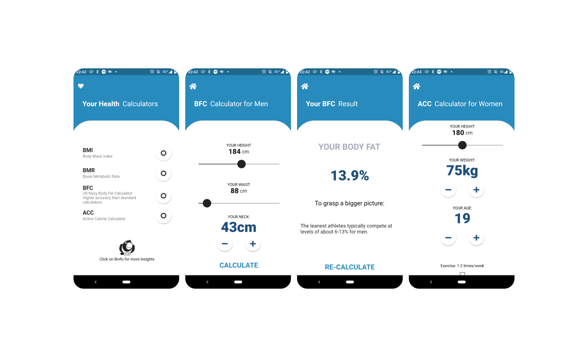

# SE_08 Clean Code

### Health Calculator App

### This App allows the user to calculate several indexes:
- BMI
- BMR
- BFC (US Navy Formula)
- ACC (Us Navy Formula

#### Tools
###### Android Studio (Flutter Extension)
###### Hyper-V Shell for Windows (git commits)
###### Programming Language: Dart
